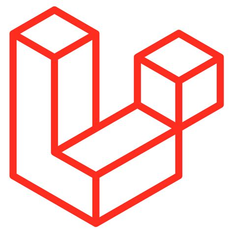

### Hi there 👋

I'm specialized in php and also prefer java, like web developer. Below I will describe in more detail what I worked with / work / what I am fond of

### now I use:

  
  
  
  
  

### enjoy, not used in production

  
  
  
  
  
  
  
  

### have work experience in production

  
  
  
  
   
  
  
  

### Important note

I would like to point out, that I do not consider myself an expert on these technologies, and it is not possible to know everything about the technology, only what is needed to solve a certain problem or task :)

technology allows us to do a lot

