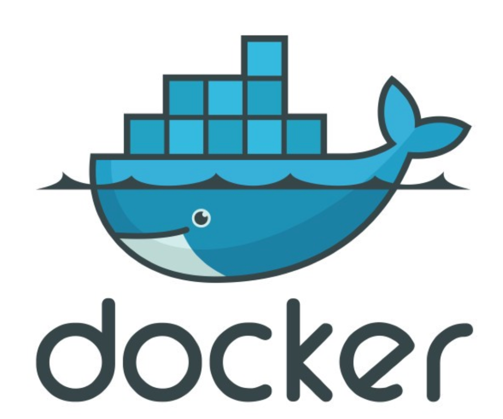

### Hi there 👋

My name is Nikita and i am a software engineer

I'm sprcialized in php and also prefer java, like web developer. Below I will describe in more detail what I worked with / work / what I am fond of

1) now I use:

  
  
  
  
  

